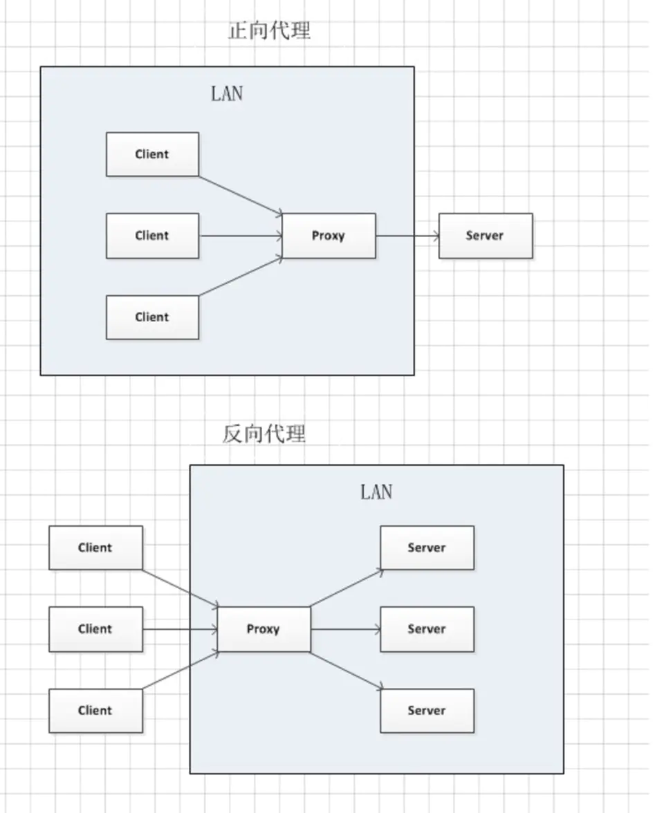

### 区分点

1. proxy处在的位置或者担任的角色。
  - 正向代理时proxy处于client侧，为client代言，server不感知client；
  - 反向代理时proxy处于server侧，为server代言，client不感知server。

2. 使用目的
  - 正向代理是为了请求端更好的访问服务
  - 反向代理是为了服务端更好的提供服务

3. 请求的地址
  - 正向代理，真实的客户端和服务端的地址不需要变化
  - 反向代理，客户端不知道服务端的真实地址，只能通过代理去访问服务

4. 自己的话术
  - 正向代理，客户为了自己更好的访问主动做的代理，比如翻墙
  - 反向代理，服务提供商为了让用户享受更好的服务做得代理

### 应用场景
- 正向代理  Charles抓包，翻墙
- 反向代理  nginx反向代理做负载均衡，外网发布，安全性

### webpack中的devServer是正向代理还是反向代理
答案应该是反向代理。站在web页面开发者的角度看他其实不关心这个devServer代理到哪里，只要有正确的数据返回就行。而devServer启动的是一个单独的node服务，由他来访问真实的其他服务。